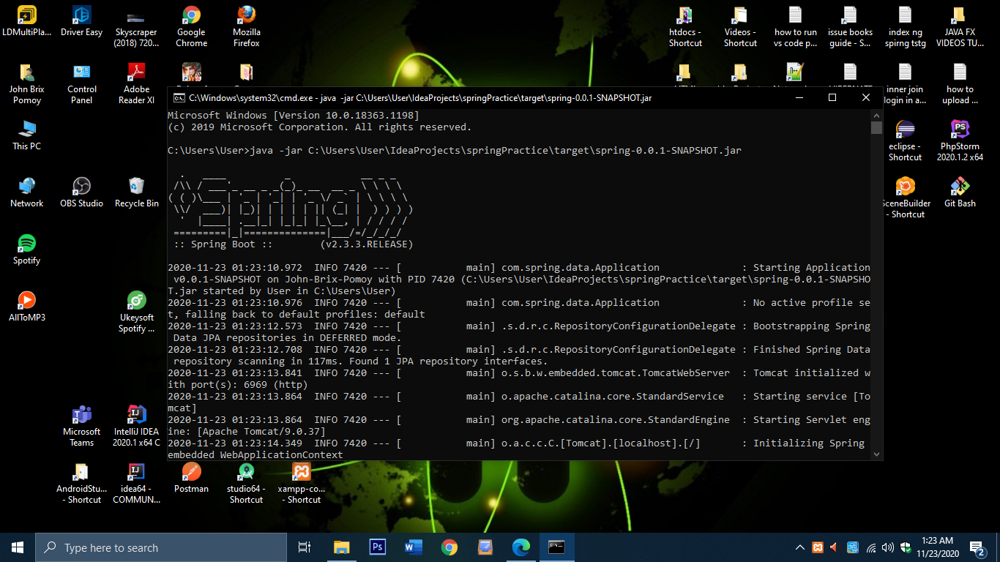

# Spring-Boot-API-CRUD
I create a simple API CRUD with a Client Side.

<h1> Update Changes: </h1>

- 12/11/2020 Added Login function
- You can see from UserAPIController.java
- See the CrossOrigins How to call them in FormUrlCoded at postman.

<h1>Requirements: </h1>

- Mysql
- Java
- Spring Boot
- Eclipse Or Intellij IDEA Ultimate
- Postman
- Spring Data JPA
- XAMPP

<h1> How to Install </h1>

- Download the Project and Import to your IDE Eclipse or either your Intellij IDEA Ultimate
- Config your Mysql go to Sql Folder and open your Xampp import the spring_boot_api_crud.sql
- Sync your Maven and wait for downloading libraries.
- Once its done you can run and open http://localhost:6969 at your browser

<h1>Client Side with CRUD Spring Data JPA </h1>

<h1>@GetMapping: </h1>

<h1>@PostMapping: </h1>

<h1>@PutMapping: </h1>

<h1>@DeleteMapping: </h1>

<h1>If you want to use the API from different Platform and build as JAR Application.</h1>

- Go to terminal (Your IDE) type this mvnw clean package, once is done go to target folder you may see this spring-0.0.1-SNAPSHOT.jar along with orignal extension path.
- Copy the absolute path of spring-0.0.1-SNAPSHOT.jar
- Open CMD type java -jar "paste the absolute path here" (if cannot find then your Environment Variables JAVA_HOME must be in System Variables)
- then enter you will see this.

<h1> How to find your IP to run in the localhost</h1>

- open cmd and type this ipconfig
- look for your ipv4 address with your wirelass adapter (This is my modem so i use this)
- open this in your browser http://192.168.1.0:6969 (192.168.1.0 is my modem Ipv4 Address its up to you what you gonna use it.)
- you will see the client side.

